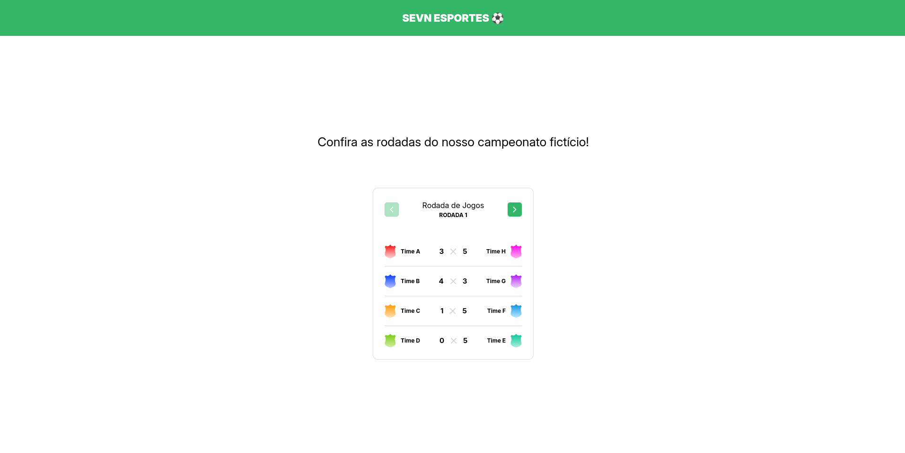

<h1 align="center">
    SEVN | Esportes
</h1>

<p align="center">
 <a href="#usage">Usage</a> •
 <a href="#contribution">Contribution</a> •
 <a href="#author">Author</a> •
 <a href="#license">License</a>
</p>

<h1 align="center">
  <div style="display: flex; flex-direction: row;">
    
  <div>
</h1>

<h4 align="center">
	  SEVN | Esportes
</h4>

The following tools were used in the construction of the project:

<h2 id="usage" > 👷 Usage </h2>
Required! Install git, node and yarn (or npm).

```bash
# Clone Repository
$ git clone https://github.com/RodrigoSaantos/sevn-esportes.git

# Go to folder classroom
$ cd sevn/

# Install Dependencies
$ yarn
# or
$ npm install

# Run Application
$ yarn dev
# or
$ npm run dev

# Access localhost
http://localhost:5173/
```

<h2 id="contribution"> 🤝 Contribution </h2>

This project is for study purposes too. All kinds of contributions are very welcome and appreciated!

- Fork this repository;
- Create a branch with your feature: `git checkout -b my-feature`;
- Commit your changes: `git commit -m 'feat: My new feature'`;
- Push to your branch: `git push origin my-feature`.

<h2 id="author"> 💻 Author </h2>


By Rodrigo Santos 👋🏽 Find me:

[](https://www.linkedin.com/in/rodrigosaantos/)
|
[](mailto:contato.rodrigosaantos@gmail.com)

<h2 id="license"> 📝 License </h2>

This project is under the MIT license.